# Polychron

Generative polyrhythmic composition engine. Two independent rhythmic layers
interact through cross-layer musical systems, trust scoring, feedback loops, and
self-calibrating hypermeta controllers to produce MIDI compositions with
emergent structure.

Development has two interleaving domains:

- **Composition engine:** `src/`, documented from [doc/composition.md](doc/composition.md) into
  [doc/composition-full.md](doc/composition-full.md).
- **HME substrate:** `tools/HME/`, documented from [doc/self-coherence.md](doc/self-coherence.md) into
  [doc/self-coherence-full.md](doc/self-coherence-full.md).

HME reads project facts from [config/project-adapter.json](config/project-adapter.json).
A new project should be able to replace `src/` and `doc/composition.md`, then
update that adapter instead of editing HME internals.

[AGENTS.md](doc/templates/AGENTS.md) is the concise operational rule file loaded by agents.
Mechanical rules belong in lint, hooks, validators, and HME policies.

## Quick Start

```bash
npm install
npm run main
npm run render
```

Prerequisites: Node.js 20+, Python 3, FluidSynth, FFmpeg, and the SF2 soundfont
at `~/Downloads/SGM-v2.01-NicePianosGuitarsBass-V1.2.sf2`.

Lab sketches:

```bash
node src/lab/run.js
node src/lab/run.js sketch-name
```

## Core Structure

- **Conductor:** computes density, tension, flicker, regime, and other global
  signals. Hypermeta controllers tune thresholds, gains, and recovery behavior.
- **Cross-layer systems:** coordinate the two rhythmic layers through rhythm,
  harmony, dynamics, structure, trust, convergence, feedback, and CIM dials.
- **Play loop:** alternates L1/L2 with per-layer state isolation, emits notes,
  then records cross-layer outcomes back into trust and feedback systems.
- **HME:** proxy, event kernel, hooks, KB, verifiers, and `i/` commands that keep
  the codebase, docs, and agent loop coherent.

## Repo Map

```mermaid
graph TD
    root["Polychron<br/><i>Generative polyrhythmic composition engine. Two independent rhythmic layers</i>"]
    config["config/<br/><i>Project-level runtime configuration files consumed by src/ entry points.</i>"]
    doc["doc/"]
    src["src/<br/><i>Polychron composition engine source: composers, conductor, cross-layer, fx, w...</i>"]
    tools["tools/<br/><i>Project tooling: HME (hierarchical meta-evolution), csv_maestro, bin/.</i>"]
    doc__infra["infra/<br/><i>Tools that keep docs up to date without hand-maintained drift.</i>"]
    doc__templates["templates/"]
    doc__theory["theory/<br/><i>> The literature of Polychron. Not how the system works -- what the system *m...</i>"]
    src__composers["composers/<br/><i>Note-producing modules. Each composer takes a beat context, consults trust/re...</i>"]
    src__conductor["conductor/<br/><i>The hypermeta layer -- 19 self-calibrating controllers that own every couplin...</i>"]
    src__crossLayer["crossLayer/<br/><i>Consumer of conductor signals, producer of per-beat emission decisions. Signa...</i>"]
    src__fx["fx/<br/><i>Audio effects + post-processing applied to rendered output.</i>"]
    src__lab["lab/<br/><i>Sketch playground for prototyping behavior before promoting to `src/`. Each s...</i>"]
    src__output["output/"]
    src__play["play/<br/><i>The composition engine -- beat pipeline, layer alternation, note emission, an...</i>"]
    src__rhythm["rhythm/<br/><i>Rhythm generation subsystem. `RhythmManager` is the single hub -- pattern gen...</i>"]
    src__scripts["scripts/<br/><i>Project-level scripts: pipeline orchestrators, generators, utilities.</i>"]
    src__tests["tests/<br/><i>Project (composition) test suite. HME-specific tests live under tools/HME/tes...</i>"]
    src__time["time/<br/><i>Timing infrastructure -- LayerManager, BPM/meter/unit-timing setters, polyrhy...</i>"]
    src__types["types/<br/><i>Shared type definitions and small data classes used by the composition engine.</i>"]
    src__utils["utils/<br/><i>Bootstrap utilities -- the foundation every other subsystem depends on. `vali...</i>"]
    src__writer["writer/<br/><i>MIDI/score/audio writers consumed by the pipeline's final stage.</i>"]
    tools__HME["HME/<br/><i>HME meta-system: proxy, hooks, scripts, service, kernel, KB.</i>"]
    tools__bin["bin/<br/><i>Project-local binary shims and helper executables on PATH.</i>"]
    tools__csv_maestro["csv_maestro/<br/><i>This fork is used in [Polychron](https://github.com/PolychronMidi/Polychron)</i>"]
    tools__omniroute["omniroute/"]
    src__composers__chord["chord/<br/><i>Chord quality selection, voicing, harmonic priors, and progression generation...</i>"]
    src__composers__factory["factory/<br/><i>Composer instantiation and capability profile binding. `FactoryManager` is th...</i>"]
    src__composers__motif["motif/<br/><i>Motif tracking, development, and hierarchical planning from measure down to s...</i>"]
    src__composers__profiles["profiles/<br/><i>Style profile definitions -- one file per style family (blues, chords, chroma...</i>"]
    src__composers__utils["utils/<br/><i>Shared helpers used by the per-style composer modules.</i>"]
    src__composers__voice["voice/<br/><i>Per-voice note selection and voice-leading optimization. `VoiceManager` is th...</i>"]
    src__conductor__dynamics["dynamics/<br/><i>Dynamic-level signal extraction -- energy momentum, climax proximity, density...</i>"]
    src__conductor__harmonic["harmonic/<br/><i>Harmonic signal extraction -- tonality, chord function, chromatic saturation,...</i>"]
    src__conductor__journey["journey/<br/><i>Tonal trajectory planning across sections. `harmonicJourney` plans a key/mode...</i>"]
    src__conductor__melodic["melodic/<br/><i>Melodic signal extraction -- pitch trajectory, contour shape, interval balanc...</i>"]
    src__conductor__profiles["profiles/<br/><i>Static profile definitions (instrument ranges, ensemble shapes) consumed by t...</i>"]
    src__conductor__rhythmic["rhythmic/<br/><i>Rhythmic signal extraction -- phase relationships, timing drift, onset densit...</i>"]
    src__conductor__signal["signal/<br/><i>Conductor signal-layer modules: dynamics, expressive shaping, narrative arc.</i>"]
    src__conductor__texture["texture/<br/><i>Conductor texture-layer modules: voicing, articulation, balance.</i>"]
    src__crossLayer__dynamics["dynamics/<br/><i>Per-beat dynamic arc coordination -- velocity envelopes, articulation complem...</i>"]
    src__crossLayer__harmony["harmony/<br/><i>Cross-layer harmonic coordination -- consonance/dissonance steering, cadence ...</i>"]
    src__crossLayer__melody["melody/<br/><i>Cross-layer melodic coherence: motif tracking and inter-layer consistency.</i>"]
    src__crossLayer__rhythm["rhythm/<br/><i>Cross-layer rhythmic interaction -- convergence detection, emergent downbeat,...</i>"]
    src__crossLayer__structure["structure/<br/><i>Cross-layer structural coherence: entropy, integration, negotiation submodules.</i>"]
    src__fx__noise["noise/<br/><i>Simplex-noise-based parameter modulation -- velocity and pan variation driven...</i>"]
    src__fx__stutter["stutter/<br/><i>Beat-synchronized stutter effects engine. `StutterManager` is a static-class ...</i>"]
    src__rhythm__drums["drums/<br/><i>Drum pattern generation and texture coupling. `drumMap` loads before `drummer...</i>"]
    src__rhythm__feedback["feedback/<br/><i>Rhythm feedback listeners -- emission, stutter, FX, conductor regulation, and...</i>"]
    src__scripts__eslint_rules["eslint-rules/<br/><i>Custom ESLint rules that enforce the architectural invariants from `doc/templ...</i>"]
    src__scripts__music21["music21/<br/><i>music21-based helpers (notation, analysis) used by the generators and writer.</i>"]
    src__scripts__pipeline["pipeline/<br/><i>Pipeline orchestration scripts (composition, snapshot, metric write-out).</i>"]
    src__scripts__utils["utils/<br/><i>Standalone utility scripts used across src/scripts.</i>"]
    tools__HME__KB["KB/"]
    tools__HME__activity["activity/<br/><i>Activity-event registry, emitters, and rendered EVENTS.md documentation.</i>"]
    tools__HME__config["config/<br/><i>Declarative HME configuration: invariants, registries, hygiene rules.</i>"]
    tools__HME__doc["doc/<br/><i>HME developer-facing reference docs (streaming contracts, tool registries).</i>"]
    tools__HME__event_kernel["event_kernel/<br/><i>The event kernel is the canonical dispatcher for HME lifecycle and tool events.</i>"]
    tools__HME__git_hooks["git-hooks/<br/><i>Project git hooks installed by tools/HME/scripts/install-git-hooks.sh.</i>"]
    tools__HME__hme_tools["hme_tools/<br/><i>`tools/HME/hme_tools` is the single source of truth for HME's native-looking ...</i>"]
    tools__HME__hooks["hooks/<br/><i>Claude Code and Codex hooks enter through `event_kernel/*_adapter.js`. The ke...</i>"]
    tools__HME__i["i/"]
    tools__HME__launcher["launcher/<br/><i>Boot/shutdown/restart scripts for the Polychron + HME proxy bundle.</i>"]
    tools__HME__omo_bridge["omo_bridge/<br/><i>Bridge between HME and oh-my-openagent (OMO): context/pruning/tool/hook adapt...</i>"]
    tools__HME__patterns["patterns/<br/><i>Declarative trigger+action pattern definitions consumed by match-patterns.</i>"]
    tools__HME__policies["policies/<br/><i>Single registration + configuration surface for every hook-time rule</i>"]
    tools__HME__proxy["proxy/<br/><i>Authoritative MITM proxy between Claude Code and the Anthropic API. It owns c...</i>"]
    tools__HME__runtime["runtime/"]
    tools__HME__scripts["scripts/<br/><i>HME scripts: verifiers, audits, builders, agents, dashboards.</i>"]
    tools__HME__service["service/<br/><i>HME runtime service (worker, daemons, analysis): one long-lived process per k...</i>"]
    tools__HME__systemd["systemd/<br/><i>systemd unit files for running HME service components as user/system services.</i>"]
    tools__HME__telemetry["telemetry/<br/><i>Telemetry collectors and rotators for HME runtime metrics.</i>"]
    tools__HME__tests["tests/<br/><i>HME test suite: specs, scripts, fixtures.</i>"]
    tools__HME__warm_context_cache["warm-context-cache/<br/><i>On-disk warm cache for fast context reload between sessions.</i>"]
    tools__csv_maestro___github[".github/"]
    tools__csv_maestro__doc["doc/<br/><i>csv_maestro reference documentation: file-format spec and notes.</i>"]
    tools__csv_maestro__py_midicsv["py_midicsv/<br/><i>Python midicsv port used by csv_maestro for MIDI<->CSV roundtrips.</i>"]
    tools__csv_maestro__tests["tests/<br/><i>csv_maestro test suite.</i>"]
    tools__omniroute___next[".next/"]
    root --> config
    root --> doc
    root --> src
    root --> tools
    doc --> doc__infra
    doc --> doc__templates
    doc --> doc__theory
    src --> src__composers
    src --> src__conductor
    src --> src__crossLayer
    src --> src__fx
    src --> src__lab
    src --> src__output
    src --> src__play
    src --> src__rhythm
    src --> src__scripts
    src --> src__tests
    src --> src__time
    src --> src__types
    src --> src__utils
    src --> src__writer
    tools --> tools__HME
    tools --> tools__bin
    tools --> tools__csv_maestro
    tools --> tools__omniroute
    src__composers --> src__composers__chord
    src__composers --> src__composers__factory
    src__composers --> src__composers__motif
    src__composers --> src__composers__profiles
    src__composers --> src__composers__utils
    src__composers --> src__composers__voice
    src__conductor --> src__conductor__dynamics
    src__conductor --> src__conductor__harmonic
    src__conductor --> src__conductor__journey
    src__conductor --> src__conductor__melodic
    src__conductor --> src__conductor__profiles
    src__conductor --> src__conductor__rhythmic
    src__conductor --> src__conductor__signal
    src__conductor --> src__conductor__texture
    src__crossLayer --> src__crossLayer__dynamics
    src__crossLayer --> src__crossLayer__harmony
    src__crossLayer --> src__crossLayer__melody
    src__crossLayer --> src__crossLayer__rhythm
    src__crossLayer --> src__crossLayer__structure
    src__fx --> src__fx__noise
    src__fx --> src__fx__stutter
    src__rhythm --> src__rhythm__drums
    src__rhythm --> src__rhythm__feedback
    src__scripts --> src__scripts__eslint_rules
    src__scripts --> src__scripts__music21
    src__scripts --> src__scripts__pipeline
    src__scripts --> src__scripts__utils
    tools__HME --> tools__HME__KB
    tools__HME --> tools__HME__activity
    tools__HME --> tools__HME__config
    tools__HME --> tools__HME__doc
    tools__HME --> tools__HME__event_kernel
    tools__HME --> tools__HME__git_hooks
    tools__HME --> tools__HME__hme_tools
    tools__HME --> tools__HME__hooks
    tools__HME --> tools__HME__i
    tools__HME --> tools__HME__launcher
    tools__HME --> tools__HME__omo_bridge
    tools__HME --> tools__HME__patterns
    tools__HME --> tools__HME__policies
    tools__HME --> tools__HME__proxy
    tools__HME --> tools__HME__runtime
    tools__HME --> tools__HME__scripts
    tools__HME --> tools__HME__service
    tools__HME --> tools__HME__systemd
    tools__HME --> tools__HME__telemetry
    tools__HME --> tools__HME__tests
    tools__HME --> tools__HME__warm_context_cache
    tools__csv_maestro --> tools__csv_maestro___github
    tools__csv_maestro --> tools__csv_maestro__doc
    tools__csv_maestro --> tools__csv_maestro__py_midicsv
    tools__csv_maestro --> tools__csv_maestro__tests
    tools__omniroute --> tools__omniroute___next
```

<!-- BEGIN_REPO_MERMAID -->
<!-- auto-generated by tools/HME/scripts/generate-repo-mermaid.py (max_depth=3); do not edit by hand -->

<!-- END_REPO_MERMAID -->

## Documentation Path

Read progressively:

1. [README.md](README.md) - project orientation.
2. [AGENTS.md](doc/templates/AGENTS.md) - agent rules and hard workflow discipline.
3. [doc/composition.md](doc/composition.md) - concise composition-engine rules.
4. [doc/self-coherence.md](doc/self-coherence.md) - concise HME rules and workflow.
5. [doc/composition-full.md](doc/composition-full.md) - detailed composition architecture.
6. [doc/self-coherence-full.md](doc/self-coherence-full.md) - detailed HME architecture.

Templates and long-form theory remain in [doc/templates/](doc/templates/) and
[doc/theory/](doc/theory/).

## Diagnostics

Hook/autocommit wiring and portability:

```bash
tools/HME/scripts/hme-doctor.py --hooks
tools/HME/scripts/hme-doctor.py --portable
```

Composition artifacts live in `src/output/metrics/`:

- `trace-summary.json` - beat, signal, regime, coupling, and trust summary.
- `fingerprint-comparison.json` - STABLE / EVOLVED / DRIFTED verdict.
- `runtime-snapshots.json` - live controller and cross-layer state.
- `adaptive-state.json` - warm-start state for the next run.
- `feedback_graph.json` - closed-loop topology.
- `narrative-digest.md` - prose composition summary.

HME telemetry lives in `tools/HME/runtime/metrics/`.

## Dependencies

- `@tonaljs/rhythm-pattern`
- Node.js built-ins
- FluidSynth + FFmpeg for rendering
