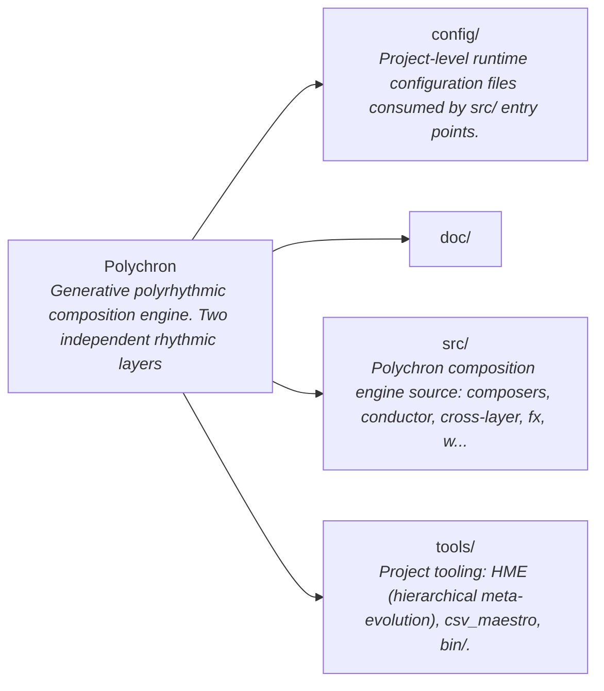
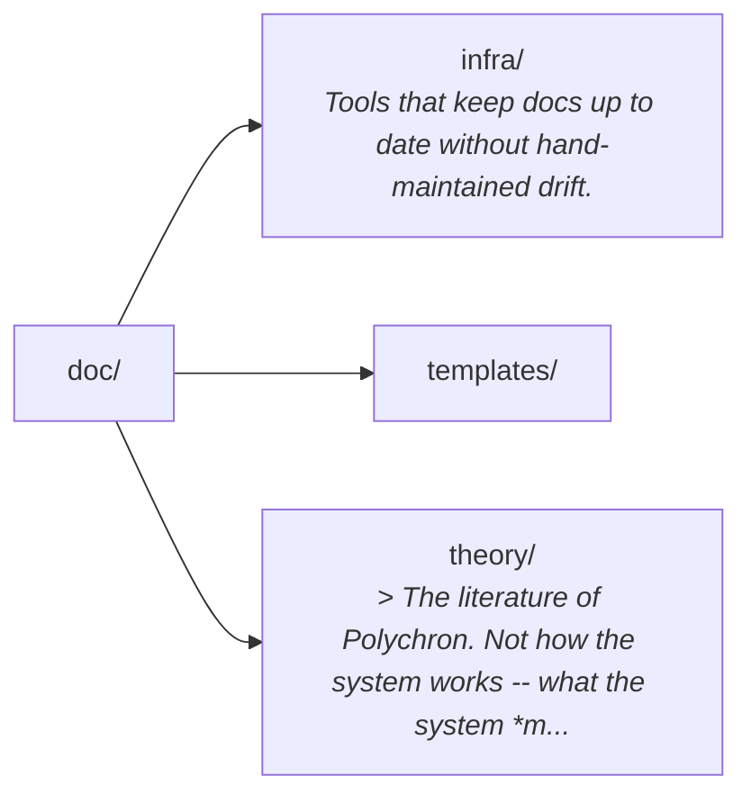

# Polychron

Generative polyrhythmic composition engine. Two independent rhythmic layers
interact through cross-layer musical systems, trust scoring, feedback loops, and
self-calibrating hypermeta controllers to produce MIDI compositions with
emergent structure.

Development has two interleaving domains:

- **Composition engine:** `src/`, documented from [doc/composition.md](doc/composition.md) into
  [doc/composition-full.md](doc/composition-full.md).
- **HME substrate:** `tools/HME/`, documented from [doc/self-coherence.md](doc/self-coherence.md) into
  [doc/self-coherence-full.md](doc/self-coherence-full.md).

HME reads project facts from [config/project-adapter.json](config/project-adapter.json).
A new project should be able to replace `src/` and `doc/composition.md`, then
update that adapter instead of editing HME internals.

[AGENTS.md](doc/templates/AGENTS.md) is the concise operational rule file loaded by agents.
Mechanical rules belong in lint, hooks, validators, and HME policies.

## Quick Start

```bash
npm install
npm run main
npm run render
```

Prerequisites: Node.js 20+, Python 3, FluidSynth, FFmpeg, and the SF2 soundfont
at `~/Downloads/SGM-v2.01-NicePianosGuitarsBass-V1.2.sf2`.

Lab sketches:

```bash
node src/lab/run.js
node src/lab/run.js sketch-name
```

## Core Structure

- **Conductor:** computes density, tension, flicker, regime, and other global
  signals. Hypermeta controllers tune thresholds, gains, and recovery behavior.
- **Cross-layer systems:** coordinate the two rhythmic layers through rhythm,
  harmony, dynamics, structure, trust, convergence, feedback, and CIM dials.
- **Play loop:** alternates L1/L2 with per-layer state isolation, emits notes,
  then records cross-layer outcomes back into trust and feedback systems.
- **HME:** proxy, event kernel, hooks, KB, verifiers, and `i/` commands that keep
  the codebase, docs, and agent loop coherent.

## Repo Map

<!-- BEGIN_REPO_MERMAID -->
<!-- auto-generated by tools/HME/scripts/generate-repo-mermaid.py; do not edit by hand. GitHub's mermaid renderer supports click-to-expand and pan/zoom on each diagram below. -->

### Overview



### `doc/`



### `src/`

```mermaid
flowchart LR
    src["src/<br/><i>Polychron composition engine source: composers, conductor, cross-layer, fx, w...</i>"]
    src__composers["composers/<br/><i>Note-producing modules. Each composer takes a beat context, consults trust/re...</i>"]
    src__conductor["conductor/<br/><i>The hypermeta layer -- 19 self-calibrating controllers that own every couplin...</i>"]
    src__crossLayer["crossLayer/<br/><i>Consumer of conductor signals, producer of per-beat emission decisions. Signa...</i>"]
    src__fx["fx/<br/><i>Audio effects + post-processing applied to rendered output.</i>"]
    src__lab["lab/<br/><i>Sketch playground for prototyping behavior before promoting to `src/`. Each s...</i>"]
    src__output["output/"]
    src__play["play/<br/><i>The composition engine -- beat pipeline, layer alternation, note emission, an...</i>"]
    src__rhythm["rhythm/<br/><i>Rhythm generation subsystem. `RhythmManager` is the single hub -- pattern gen...</i>"]
    src__scripts["scripts/<br/><i>Project-level scripts: pipeline orchestrators, generators, utilities.</i>"]
    src__tests["tests/<br/><i>Project (composition) test suite. Tests for any code under `src/`</i>"]
    src__time["time/<br/><i>Timing infrastructure -- LayerManager, BPM/meter/unit-timing setters, polyrhy...</i>"]
    src__types["types/<br/><i>Shared type definitions and small data classes used by the composition engine.</i>"]
    src__utils["utils/<br/><i>Bootstrap utilities -- the foundation every other subsystem depends on. `vali...</i>"]
    src__writer["writer/<br/><i>MIDI/score/audio writers consumed by the pipeline's final stage.</i>"]
    src__composers__chord["composers/chord/<br/><i>Chord quality selection, voicing, harmonic priors, and progression generation...</i>"]
    src__composers__factory["composers/factory/<br/><i>Composer instantiation and capability profile binding. `FactoryManager` is th...</i>"]
    src__composers__motif["composers/motif/<br/><i>Motif tracking, development, and hierarchical planning from measure down to s...</i>"]
    src__composers__profiles["composers/profiles/<br/><i>Style profile definitions -- one file per style family (blues, chords, chroma...</i>"]
    src__composers__utils["composers/utils/<br/><i>Composer-local helpers shared across the per-style composer modules</i>"]
    src__composers__voice["composers/voice/<br/><i>Per-voice note selection and voice-leading optimization. `VoiceManager` is th...</i>"]
    src__conductor__dynamics["conductor/dynamics/<br/><i>Dynamic-level signal extraction -- energy momentum, climax proximity, density...</i>"]
    src__conductor__harmonic["conductor/harmonic/<br/><i>Harmonic signal extraction -- tonality, chord function, chromatic saturation,...</i>"]
    src__conductor__journey["conductor/journey/<br/><i>Tonal trajectory planning across sections. `harmonicJourney` plans a key/mode...</i>"]
    src__conductor__melodic["conductor/melodic/<br/><i>Melodic signal extraction -- pitch trajectory, contour shape, interval balanc...</i>"]
    src__conductor__profiles["conductor/profiles/<br/><i>Static ensemble-configuration profiles (instrument ranges, ensemble</i>"]
    src__conductor__rhythmic["conductor/rhythmic/<br/><i>Rhythmic signal extraction -- phase relationships, timing drift, onset densit...</i>"]
    src__conductor__signal["conductor/signal/<br/><i>Conductor signal-layer modules: dynamics, expressive shaping, narrative arc.</i>"]
    src__conductor__texture["conductor/texture/<br/><i>Conductor texture-layer modules: voicing, articulation, balance.</i>"]
    src__crossLayer__dynamics["crossLayer/dynamics/<br/><i>Per-beat dynamic arc coordination -- velocity envelopes, articulation complem...</i>"]
    src__crossLayer__harmony["crossLayer/harmony/<br/><i>Cross-layer harmonic coordination -- consonance/dissonance steering, cadence ...</i>"]
    src__crossLayer__melody["crossLayer/melody/<br/><i>Cross-layer melodic coherence: motif tracking and inter-layer consistency.</i>"]
    src__crossLayer__rhythm["crossLayer/rhythm/<br/><i>Cross-layer rhythmic interaction -- convergence detection, emergent downbeat,...</i>"]
    src__crossLayer__structure["crossLayer/structure/<br/><i>Cross-layer structural coherence: entropy, integration, negotiation submodules.</i>"]
    src__fx__noise["fx/noise/<br/><i>Simplex-noise-based parameter modulation -- velocity and pan variation driven...</i>"]
    src__fx__stutter["fx/stutter/<br/><i>Beat-synchronized stutter effects engine. `StutterManager` is a static-class ...</i>"]
    src__rhythm__drums["rhythm/drums/<br/><i>Drum pattern generation and texture coupling. `drumMap` loads before `drummer...</i>"]
    src__rhythm__feedback["rhythm/feedback/<br/><i>Rhythm feedback listeners -- emission, stutter, FX, conductor regulation, and...</i>"]
    src__scripts__eslint_rules["scripts/eslint-rules/<br/><i>Custom ESLint rules that enforce the architectural invariants from `doc/templ...</i>"]
    src__scripts__music21["scripts/music21/<br/><i>music21-based helpers (notation, analysis) used by the generators and writer.</i>"]
    src__scripts__pipeline["scripts/pipeline/<br/><i>Pipeline orchestration scripts (composition, snapshot, metric write-out).</i>"]
    src__scripts__utils["scripts/utils/<br/><i>Standalone utility scripts used by pipeline orchestrators and</i>"]
    src__conductor__signal__balancing["conductor/signal/balancing/<br/><i>Coupling-energy redistribution layer. `axisEnergyEquilibrator` is the hyperme...</i>"]
    src__conductor__signal__foundations["conductor/signal/foundations/<br/><i>Signal infrastructure -- normalization, coherence monitoring, signal reading,...</i>"]
    src__conductor__signal__meta["conductor/signal/meta/<br/><i>The actual hypermeta brains. Every controller self-registers at load time via...</i>"]
    src__conductor__signal__narrative["conductor/signal/narrative/<br/><i>Narrative-arc shaping helpers used by the conductor signal layer.</i>"]
    src__conductor__signal__output["conductor/signal/output/"]
    src__conductor__signal__profiling["conductor/signal/profiling/<br/><i>Regime classification and phase-space trajectory analysis. Two authorities li...</i>"]
    src__conductor__texture__articulation["conductor/texture/articulation/<br/><i>Articulation choice (legato/staccato/accent) for the texture layer.</i>"]
    src__conductor__texture__balance["conductor/texture/balance/<br/><i>Inter-voice balance computation for the texture layer.</i>"]
    src__conductor__texture__form["conductor/texture/form/<br/><i>Structural form tracking -- section length, silence distribution, textural gr...</i>"]
    src__conductor__texture__layers["conductor/texture/layers/<br/><i>Cross-layer density and coherence analysis from the conductor side -- onset d...</i>"]
    src__conductor__texture__phrasing["conductor/texture/phrasing/<br/><i>Phrasing signal extraction -- motivic density, orchestration weight, pedal po...</i>"]
    src__crossLayer__structure__entropy["crossLayer/structure/entropy/<br/><i>Entropy-based structural metrics for cross-layer evaluation.</i>"]
    src__crossLayer__structure__form["crossLayer/structure/form/<br/><i>Cross-layer structural form -- climax orchestration, silhouette tracking, and...</i>"]
    src__crossLayer__structure__integration["crossLayer/structure/integration/<br/><i>Layer-integration metrics measuring how layers cohere.</i>"]
    src__crossLayer__structure__negotiation["crossLayer/structure/negotiation/<br/><i>Negotiation/arbitration between competing cross-layer constraints.</i>"]
    src__crossLayer__structure__trust["crossLayer/structure/trust/<br/><i>Trust ecology -- per-system adaptive scores, velocity nourishment, timbre map...</i>"]
    src__fx__stutter__variants["fx/stutter/variants/<br/><i>The 20 stutter variant implementations. Each self-registers into `stutterRegi...</i>"]
    src__scripts__pipeline__generators["scripts/pipeline/generators/<br/><i>Per-stage generator scripts invoked from the pipeline driver.</i>"]
    src__scripts__pipeline__validators["scripts/pipeline/validators/<br/><i>Phase-gated checks run by `main-pipeline.js`. Each validator is a standalone ...</i>"]
    src__conductor__signal__balancing__coupling["conductor/signal/balancing/coupling/<br/><i>Self-tuning decorrelation engine. `pipelineCouplingManager` is the thin orche...</i>"]
    src__conductor__signal__meta__manager["conductor/signal/meta/manager/<br/><i>`hyperMetaManager` is the primary orchestration hub for the hypermeta layer -...</i>"]
    src__conductor__signal__balancing__coupling__homeostasis["conductor/signal/balancing/coupling/homeostasis/<br/><i>Per-beat global-gain multiplier management for the coupling engine. Two entry...</i>"]
    src --> src__composers
    src --> src__conductor
    src --> src__crossLayer
    src --> src__fx
    src --> src__lab
    src --> src__output
    src --> src__play
    src --> src__rhythm
    src --> src__scripts
    src --> src__tests
    src --> src__time
    src --> src__types
    src --> src__utils
    src --> src__writer
    src__composers --> src__composers__chord
    src__composers --> src__composers__factory
    src__composers --> src__composers__motif
    src__composers --> src__composers__profiles
    src__composers --> src__composers__utils
    src__composers --> src__composers__voice
    src__conductor --> src__conductor__dynamics
    src__conductor --> src__conductor__harmonic
    src__conductor --> src__conductor__journey
    src__conductor --> src__conductor__melodic
    src__conductor --> src__conductor__profiles
    src__conductor --> src__conductor__rhythmic
    src__conductor --> src__conductor__signal
    src__conductor --> src__conductor__texture
    src__crossLayer --> src__crossLayer__dynamics
    src__crossLayer --> src__crossLayer__harmony
    src__crossLayer --> src__crossLayer__melody
    src__crossLayer --> src__crossLayer__rhythm
    src__crossLayer --> src__crossLayer__structure
    src__fx --> src__fx__noise
    src__fx --> src__fx__stutter
    src__rhythm --> src__rhythm__drums
    src__rhythm --> src__rhythm__feedback
    src__scripts --> src__scripts__eslint_rules
    src__scripts --> src__scripts__music21
    src__scripts --> src__scripts__pipeline
    src__scripts --> src__scripts__utils
    src__conductor__signal --> src__conductor__signal__balancing
    src__conductor__signal --> src__conductor__signal__foundations
    src__conductor__signal --> src__conductor__signal__meta
    src__conductor__signal --> src__conductor__signal__narrative
    src__conductor__signal --> src__conductor__signal__output
    src__conductor__signal --> src__conductor__signal__profiling
    src__conductor__texture --> src__conductor__texture__articulation
    src__conductor__texture --> src__conductor__texture__balance
    src__conductor__texture --> src__conductor__texture__form
    src__conductor__texture --> src__conductor__texture__layers
    src__conductor__texture --> src__conductor__texture__phrasing
    src__crossLayer__structure --> src__crossLayer__structure__entropy
    src__crossLayer__structure --> src__crossLayer__structure__form
    src__crossLayer__structure --> src__crossLayer__structure__integration
    src__crossLayer__structure --> src__crossLayer__structure__negotiation
    src__crossLayer__structure --> src__crossLayer__structure__trust
    src__fx__stutter --> src__fx__stutter__variants
    src__scripts__pipeline --> src__scripts__pipeline__generators
    src__scripts__pipeline --> src__scripts__pipeline__validators
    src__conductor__signal__balancing --> src__conductor__signal__balancing__coupling
    src__conductor__signal__meta --> src__conductor__signal__meta__manager
    src__conductor__signal__balancing__coupling --> src__conductor__signal__balancing__coupling__homeostasis
```



### `tools/`

```mermaid
flowchart LR
    tools["tools/<br/><i>Project tooling: HME (hierarchical meta-evolution), csv_maestro, bin/.</i>"]
    tools__HME["HME/<br/><i>HME meta-system: proxy, hooks, scripts, service, kernel, KB.</i>"]
    tools__bin["bin/<br/><i>Project-local binary shims and helper executables on PATH.</i>"]
    tools__csv_maestro["csv_maestro/<br/><i>This fork is used in [Polychron](https://github.com/PolychronMidi/Polychron)</i>"]
    tools__omniroute["omniroute/"]
    tools__HME__KB["HME/KB/"]
    tools__HME__activity["HME/activity/<br/><i>Activity-event registry, emitters, and rendered EVENTS.md documentation.</i>"]
    tools__HME__config["HME/config/<br/><i>Declarative HME configuration: invariants, registries, hygiene rules.</i>"]
    tools__HME__doc["HME/doc/<br/><i>HME developer-facing reference docs (streaming contracts, tool registries).</i>"]
    tools__HME__event_kernel["HME/event_kernel/<br/><i>The event kernel is the canonical dispatcher for HME lifecycle and tool events.</i>"]
    tools__HME__git_hooks["HME/git-hooks/<br/><i>Project git hooks installed by tools/HME/scripts/install-git-hooks.sh.</i>"]
    tools__HME__hme_tools["HME/hme_tools/<br/><i>`tools/HME/hme_tools` is the single source of truth for HME's native-looking ...</i>"]
    tools__HME__hooks["HME/hooks/<br/><i>Claude Code and Codex hooks enter through `event_kernel/*_adapter.js`. The ke...</i>"]
    tools__HME__i["HME/i/"]
    tools__HME__launcher["HME/launcher/<br/><i>Boot/shutdown/restart scripts for the Polychron + HME proxy bundle.</i>"]
    tools__HME__omo_bridge["HME/omo_bridge/<br/><i>Bridge between HME and oh-my-openagent (OMO): context/pruning/tool/hook adapt...</i>"]
    tools__HME__patterns["HME/patterns/<br/><i>Declarative trigger+action pattern definitions consumed by match-patterns.</i>"]
    tools__HME__policies["HME/policies/<br/><i>Single registration + configuration surface for every hook-time rule</i>"]
    tools__HME__proxy["HME/proxy/<br/><i>Authoritative MITM proxy between Claude Code and the Anthropic API. It owns c...</i>"]
    tools__HME__runtime["HME/runtime/"]
    tools__HME__scripts["HME/scripts/<br/><i>HME scripts: verifiers, audits, builders, agents, dashboards.</i>"]
    tools__HME__service["HME/service/<br/><i>HME runtime service (worker, daemons, analysis): one long-lived process per k...</i>"]
    tools__HME__systemd["HME/systemd/<br/><i>systemd unit files for running HME service components as user/system services.</i>"]
    tools__HME__telemetry["HME/telemetry/<br/><i>Telemetry collectors and rotators for HME runtime metrics.</i>"]
    tools__HME__tests["HME/tests/<br/><i>HME meta-substrate test suite: verifier specs, hook tests, proxy</i>"]
    tools__HME__warm_context_cache["HME/warm-context-cache/<br/><i>On-disk warm cache for fast context reload between sessions.</i>"]
    tools__csv_maestro___github["csv_maestro/.github/"]
    tools__csv_maestro__doc["csv_maestro/doc/<br/><i>csv_maestro reference documentation: file-format spec and notes.</i>"]
    tools__csv_maestro__py_midicsv["csv_maestro/py_midicsv/<br/><i>Python midicsv port used by csv_maestro for MIDI<->CSV roundtrips.</i>"]
    tools__csv_maestro__tests["csv_maestro/tests/<br/><i>csv_maestro test suite.</i>"]
    tools__omniroute___next["omniroute/.next/"]
    tools__HME__config__invariants["HME/config/invariants/<br/><i>Per-domain invariant shard files merged by the invariant loader.</i>"]
    tools__HME__event_kernel__native_hooks["HME/event_kernel/native_hooks/<br/><i>Native (in-process) hook handlers used by the event kernel.</i>"]
    tools__HME__hooks__direct["HME/hooks/direct/<br/><i>Direct (non-Claude-Code) hooks invoked by supervisors and launchers.</i>"]
    tools__HME__hooks__helpers["HME/hooks/helpers/<br/><i>Bash helpers sourced by every hook (safety preamble, signal bus, ledger).</i>"]
    tools__HME__hooks__lifecycle["HME/hooks/lifecycle/<br/><i>Claude Code lifecycle hooks: SessionStart, UserPromptSubmit, PreCompact, Stop.</i>"]
    tools__HME__hooks__posttooluse["HME/hooks/posttooluse/<br/><i>PostToolUse hooks (per-tool: edit, bash, read, todowrite).</i>"]
    tools__HME__hooks__pretooluse["HME/hooks/pretooluse/<br/><i>PreToolUse hooks (per-tool gates: edit, bash, read, todowrite).</i>"]
    tools__HME__policies__builtin["HME/policies/builtin/<br/><i>Built-in HME policy implementations (read/write/bash gates).</i>"]
    tools__HME__policies__examples["HME/policies/examples/<br/><i>Example HME policy stubs for reference / starter templates.</i>"]
    tools__HME__proxy__contexts["HME/proxy/contexts/<br/><i>Each subdirectory in `contexts/` is the **single façade** for a bounded</i>"]
    tools__HME__proxy__mcp_server["HME/proxy/mcp_server/<br/><i>In-process MCP (Model Context Protocol) server, hosted by `hme_proxy.js`</i>"]
    tools__HME__proxy__middleware["HME/proxy/middleware/<br/><i>Per-tool enrichment and side-effect modules. The proxy's `messages.js` pipeli...</i>"]
    tools__HME__proxy__shared["HME/proxy/shared/<br/><i>Shared utilities used across HME proxy modules.</i>"]
    tools__HME__proxy__stop_chain["HME/proxy/stop_chain/<br/><i>Stop-event chain: ordered handlers run when Claude Code emits Stop.</i>"]
    tools__HME__proxy__supervisor["HME/proxy/supervisor/<br/><i>Proxy supervisor: spawns worker + daemon, monitors health, restarts on failure.</i>"]
    tools__HME__scripts__chaos["HME/scripts/chaos/<br/><i>Chaos-engineering harnesses that perturb HME subsystems to test resilience.</i>"]
    tools__HME__scripts__detectors["HME/scripts/detectors/<br/><i>Behavioural detectors that scan transcripts for known antipatterns.</i>"]
    tools__HME__scripts__invariants["HME/scripts/invariants/<br/><i>Pluggable invariant implementations consumed by the invariant battery.</i>"]
    tools__HME__scripts__pipeline["HME/scripts/pipeline/<br/><i>Pipeline-orchestration helpers for HME (separate from src/scripts/pipeline).</i>"]
    tools__HME__scripts__verify_coherence["HME/scripts/verify_coherence/<br/><i>Verifier package implementing the HCI battery (split per domain).</i>"]
    tools__HME__service__agent_local["HME/service/agent_local/<br/><i>Local-agent runner: in-process agent loop using llama.cpp / openai-compat bac...</i>"]
    tools__HME__service__analysis["HME/service/analysis/<br/><i>Analysis subroutines invoked by the service worker (KB, RAG, etc.).</i>"]
    tools__HME__service__common["HME/service/common/<br/><i>Shared helpers used across service/ submodules.</i>"]
    tools__HME__service__llamacpp_daemon["HME/service/llamacpp_daemon/<br/><i>llama.cpp daemon supervisor: spawns + adopts llama-server children.</i>"]
    tools__HME__service__rag_engine["HME/service/rag_engine/<br/><i>Retrieval-augmented generation substrate. Owns the LanceDB tables (knowledge,...</i>"]
    tools__HME__service__server["HME/service/server/<br/><i>FastMCP server layer + context. `main.py` boots the MCP server and initialize...</i>"]
    tools__HME__service__symbols["HME/service/symbols/<br/><i>Symbol table builders (LSP-style cross-references) consumed by RAG.</i>"]
    tools__HME__service__tests["HME/service/tests/<br/><i>Service-layer test suite (separate from tools/HME/tests/).</i>"]
    tools__HME__tests___lib["HME/tests/_lib/<br/><i>Shared test helpers consumed by specs under tools/HME/tests/specs/.</i>"]
    tools__HME__tests__fixtures["HME/tests/fixtures/<br/><i>Static fixtures used by HME tests (sample projects, sample transcripts).</i>"]
    tools__HME__tests__scripts["HME/tests/scripts/<br/><i>Test scripts that drive integration-level HME flows.</i>"]
    tools__HME__tests__specs["HME/tests/specs/<br/><i>Per-feature unit/spec test files (executed by pytest / node test runners).</i>"]
    tools__csv_maestro___github__workflows["csv_maestro/.github/workflows/"]
    tools__csv_maestro__py_midicsv__midi["csv_maestro/py_midicsv/midi/<br/><i>Low-level MIDI parsing/emitting primitives for py_midicsv.</i>"]
    tools__HME__hooks__helpers__safety["HME/hooks/helpers/safety/<br/><i>Sub-helpers composing the _safety.sh dispatcher (project root, latency, etc).</i>"]
    tools__HME__hooks__lifecycle__stop["HME/hooks/lifecycle/stop/<br/><i>Stop-event sub-hooks that compose the Stop lifecycle pipeline.</i>"]
    tools__HME__hooks__pretooluse__bash["HME/hooks/pretooluse/bash/<br/><i>`pretooluse_bash.sh` auto-loads gates by phase via `bash/<phase>/*.sh`:</i>"]
    tools__HME__proxy__contexts__failure_policy["HME/proxy/contexts/failure_policy/<br/><i>Failure-policy bounded context: classify upstream failures and select a recov...</i>"]
    tools__HME__proxy__stop_chain__policies["HME/proxy/stop_chain/policies/<br/><i>Stop-chain policy modules (per-condition allow/deny/defer).</i>"]
    tools__HME__scripts__detectors__fixtures["HME/scripts/detectors/fixtures/<br/><i>Static transcript fixtures used by the detector test suite.</i>"]
    tools__HME__scripts__pipeline__hme["HME/scripts/pipeline/hme/<br/><i>HME-specific pipeline stages: match-patterns, scoring, write-out.</i>"]
    tools__HME__service__server__meta_layers["HME/service/server/meta_layers/<br/><i>Meta-layer service handlers (cross-cutting concerns over base tools).</i>"]
    tools__HME__service__server__tools_analysis["HME/service/server/tools_analysis/<br/><i>Public agent-facing tools live here. Each major tool is a unified dispatcher ...</i>"]
    tools__HME__tests__fixtures__generic_project["HME/tests/fixtures/generic-project/<br/><i>Minimal generic project layout used as a HME fixture.</i>"]
    tools__HME__tests__fixtures__swapped_project["HME/tests/fixtures/swapped-project/<br/><i>Variant project fixture exercising adapter-swap paths.</i>"]
    tools__HME__hooks__pretooluse__bash___disabled["HME/hooks/pretooluse/bash/_disabled/<br/><i>Bash-policy hooks currently disabled; kept for reference.</i>"]
    tools__HME__hooks__pretooluse__bash__post["HME/hooks/pretooluse/bash/post/<br/><i>Bash-policy post-evaluation hooks (run after the primary policy decision).</i>"]
    tools__HME__hooks__pretooluse__bash__pre["HME/hooks/pretooluse/bash/pre/<br/><i>Bash-policy pre-evaluation hooks (early-exit checks before main policy).</i>"]
    tools__HME__service__server__tools_analysis__coupling["HME/service/server/tools_analysis/coupling/<br/><i>Coupling-matrix analytics. Reads `systemDynamicsProfiler.getSnapshot().coupli...</i>"]
    tools__HME__service__server__tools_analysis__evolution["HME/service/server/tools_analysis/evolution/<br/><i>Evolution-loop internals. `evolution_evolve.py` is the public dispatcher; thi...</i>"]
    tools__HME__service__server__tools_analysis__status_unified["HME/service/server/tools_analysis/status_unified/<br/><i>Unified status tool implementation (dispatch + per-mode renderers).</i>"]
    tools__HME__service__server__tools_analysis__synthesis["HME/service/server/tools_analysis/synthesis/<br/><i>Local synthesis backends for HME's agent layer. One backend per file: `synthe...</i>"]
    tools__HME__tests__fixtures__generic_project__config["HME/tests/fixtures/generic-project/config/<br/><i>Generic-project fixture: config/ subtree.</i>"]
    tools__HME__tests__fixtures__generic_project__doc["HME/tests/fixtures/generic-project/doc/<br/><i>Generic-project fixture: doc/ subtree with canonical composition.md.</i>"]
    tools__HME__tests__fixtures__generic_project__src["HME/tests/fixtures/generic-project/src/<br/><i>Generic-project fixture: src/ subtree.</i>"]
    tools__HME__tests__fixtures__swapped_project__config["HME/tests/fixtures/swapped-project/config/<br/><i>Swapped-project fixture: config/ subtree.</i>"]
    tools__HME__tests__fixtures__swapped_project__doc["HME/tests/fixtures/swapped-project/doc/<br/><i>Swapped-project fixture: doc/ subtree with canonical composition.md.</i>"]
    tools__HME__tests__fixtures__swapped_project__src["HME/tests/fixtures/swapped-project/src/<br/><i>Swapped-project fixture: src/ subtree.</i>"]
    tools__HME__service__server__tools_analysis__evolution__evolution_invariants["HME/service/server/tools_analysis/evolution/evolution_invariants/<br/><i>Evolution-stage invariant probes evaluated each round.</i>"]
    tools__HME__service__server__tools_analysis__evolution__evolution_selftest["HME/service/server/tools_analysis/evolution/evolution_selftest/<br/><i>Evolution-stage self-test harness, executed during boot.</i>"]
    tools --> tools__HME
    tools --> tools__bin
    tools --> tools__csv_maestro
    tools --> tools__omniroute
    tools__HME --> tools__HME__KB
    tools__HME --> tools__HME__activity
    tools__HME --> tools__HME__config
    tools__HME --> tools__HME__doc
    tools__HME --> tools__HME__event_kernel
    tools__HME --> tools__HME__git_hooks
    tools__HME --> tools__HME__hme_tools
    tools__HME --> tools__HME__hooks
    tools__HME --> tools__HME__i
    tools__HME --> tools__HME__launcher
    tools__HME --> tools__HME__omo_bridge
    tools__HME --> tools__HME__patterns
    tools__HME --> tools__HME__policies
    tools__HME --> tools__HME__proxy
    tools__HME --> tools__HME__runtime
    tools__HME --> tools__HME__scripts
    tools__HME --> tools__HME__service
    tools__HME --> tools__HME__systemd
    tools__HME --> tools__HME__telemetry
    tools__HME --> tools__HME__tests
    tools__HME --> tools__HME__warm_context_cache
    tools__csv_maestro --> tools__csv_maestro___github
    tools__csv_maestro --> tools__csv_maestro__doc
    tools__csv_maestro --> tools__csv_maestro__py_midicsv
    tools__csv_maestro --> tools__csv_maestro__tests
    tools__omniroute --> tools__omniroute___next
    tools__HME__config --> tools__HME__config__invariants
    tools__HME__event_kernel --> tools__HME__event_kernel__native_hooks
    tools__HME__hooks --> tools__HME__hooks__direct
    tools__HME__hooks --> tools__HME__hooks__helpers
    tools__HME__hooks --> tools__HME__hooks__lifecycle
    tools__HME__hooks --> tools__HME__hooks__posttooluse
    tools__HME__hooks --> tools__HME__hooks__pretooluse
    tools__HME__policies --> tools__HME__policies__builtin
    tools__HME__policies --> tools__HME__policies__examples
    tools__HME__proxy --> tools__HME__proxy__contexts
    tools__HME__proxy --> tools__HME__proxy__mcp_server
    tools__HME__proxy --> tools__HME__proxy__middleware
    tools__HME__proxy --> tools__HME__proxy__shared
    tools__HME__proxy --> tools__HME__proxy__stop_chain
    tools__HME__proxy --> tools__HME__proxy__supervisor
    tools__HME__scripts --> tools__HME__scripts__chaos
    tools__HME__scripts --> tools__HME__scripts__detectors
    tools__HME__scripts --> tools__HME__scripts__invariants
    tools__HME__scripts --> tools__HME__scripts__pipeline
    tools__HME__scripts --> tools__HME__scripts__verify_coherence
    tools__HME__service --> tools__HME__service__agent_local
    tools__HME__service --> tools__HME__service__analysis
    tools__HME__service --> tools__HME__service__common
    tools__HME__service --> tools__HME__service__llamacpp_daemon
    tools__HME__service --> tools__HME__service__rag_engine
    tools__HME__service --> tools__HME__service__server
    tools__HME__service --> tools__HME__service__symbols
    tools__HME__service --> tools__HME__service__tests
    tools__HME__tests --> tools__HME__tests___lib
    tools__HME__tests --> tools__HME__tests__fixtures
    tools__HME__tests --> tools__HME__tests__scripts
    tools__HME__tests --> tools__HME__tests__specs
    tools__csv_maestro___github --> tools__csv_maestro___github__workflows
    tools__csv_maestro__py_midicsv --> tools__csv_maestro__py_midicsv__midi
    tools__HME__hooks__helpers --> tools__HME__hooks__helpers__safety
    tools__HME__hooks__lifecycle --> tools__HME__hooks__lifecycle__stop
    tools__HME__hooks__pretooluse --> tools__HME__hooks__pretooluse__bash
    tools__HME__proxy__contexts --> tools__HME__proxy__contexts__failure_policy
    tools__HME__proxy__stop_chain --> tools__HME__proxy__stop_chain__policies
    tools__HME__scripts__detectors --> tools__HME__scripts__detectors__fixtures
    tools__HME__scripts__pipeline --> tools__HME__scripts__pipeline__hme
    tools__HME__service__server --> tools__HME__service__server__meta_layers
    tools__HME__service__server --> tools__HME__service__server__tools_analysis
    tools__HME__tests__fixtures --> tools__HME__tests__fixtures__generic_project
    tools__HME__tests__fixtures --> tools__HME__tests__fixtures__swapped_project
    tools__HME__hooks__pretooluse__bash --> tools__HME__hooks__pretooluse__bash___disabled
    tools__HME__hooks__pretooluse__bash --> tools__HME__hooks__pretooluse__bash__post
    tools__HME__hooks__pretooluse__bash --> tools__HME__hooks__pretooluse__bash__pre
    tools__HME__service__server__tools_analysis --> tools__HME__service__server__tools_analysis__coupling
    tools__HME__service__server__tools_analysis --> tools__HME__service__server__tools_analysis__evolution
    tools__HME__service__server__tools_analysis --> tools__HME__service__server__tools_analysis__status_unified
    tools__HME__service__server__tools_analysis --> tools__HME__service__server__tools_analysis__synthesis
    tools__HME__tests__fixtures__generic_project --> tools__HME__tests__fixtures__generic_project__config
    tools__HME__tests__fixtures__generic_project --> tools__HME__tests__fixtures__generic_project__doc
    tools__HME__tests__fixtures__generic_project --> tools__HME__tests__fixtures__generic_project__src
    tools__HME__tests__fixtures__swapped_project --> tools__HME__tests__fixtures__swapped_project__config
    tools__HME__tests__fixtures__swapped_project --> tools__HME__tests__fixtures__swapped_project__doc
    tools__HME__tests__fixtures__swapped_project --> tools__HME__tests__fixtures__swapped_project__src
    tools__HME__service__server__tools_analysis__evolution --> tools__HME__service__server__tools_analysis__evolution__evolution_invariants
    tools__HME__service__server__tools_analysis__evolution --> tools__HME__service__server__tools_analysis__evolution__evolution_selftest
```
<!-- END_REPO_MERMAID -->

## Documentation Path

Read progressively:

1. [README.md](README.md) - project orientation.
2. [AGENTS.md](doc/templates/AGENTS.md) - agent rules and hard workflow discipline.
3. [doc/composition.md](doc/composition.md) - concise composition-engine rules.
4. [doc/self-coherence.md](doc/self-coherence.md) - concise HME rules and workflow.
5. [doc/composition-full.md](doc/composition-full.md) - detailed composition architecture.
6. [doc/self-coherence-full.md](doc/self-coherence-full.md) - detailed HME architecture.

Templates and long-form theory remain in [doc/templates/](doc/templates/) and
[doc/theory/](doc/theory/).

## Diagnostics

Hook/autocommit wiring and portability:

```bash
tools/HME/scripts/hme-doctor.py --hooks
tools/HME/scripts/hme-doctor.py --portable
```

Composition artifacts live in `src/output/metrics/`:

- `trace-summary.json` - beat, signal, regime, coupling, and trust summary.
- `fingerprint-comparison.json` - STABLE / EVOLVED / DRIFTED verdict.
- `runtime-snapshots.json` - live controller and cross-layer state.
- `adaptive-state.json` - warm-start state for the next run.
- `feedback_graph.json` - closed-loop topology.
- `narrative-digest.md` - prose composition summary.

HME telemetry lives in `tools/HME/runtime/metrics/`.

## Dependencies

- `@tonaljs/rhythm-pattern`
- Node.js built-ins
- FluidSynth + FFmpeg for rendering
